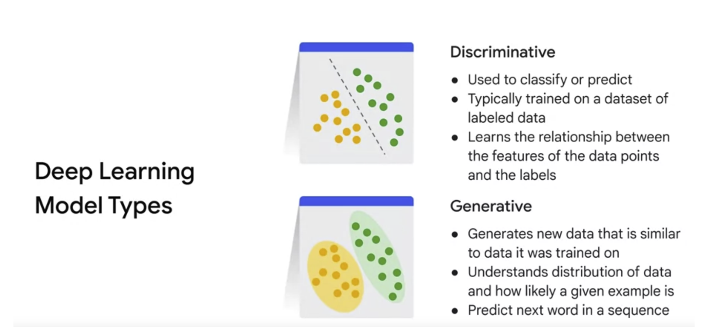
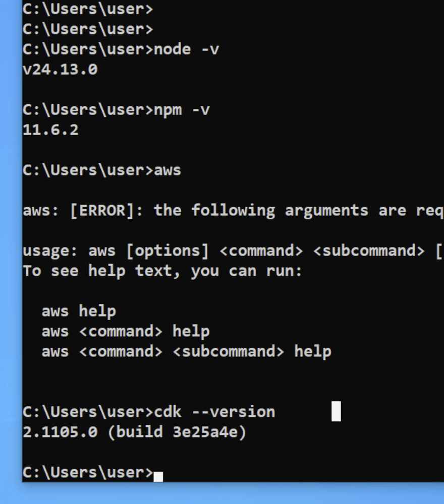
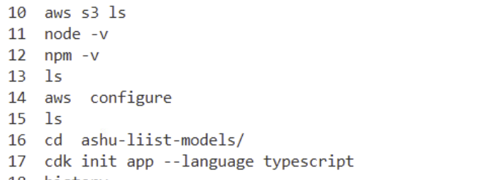

# BMO_genAI_10thfeb2026

### AI category 



### checking lab details info 



### cdk will be using aws keys to connect 

```
aws configure

```

### configure cdk init 



### Installing bedrock-client 

```
npm install -g @aws-sdk/client-bedrock
```
